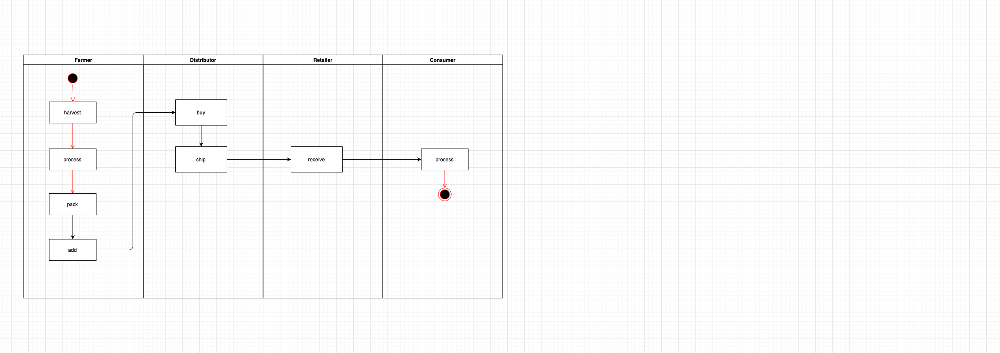
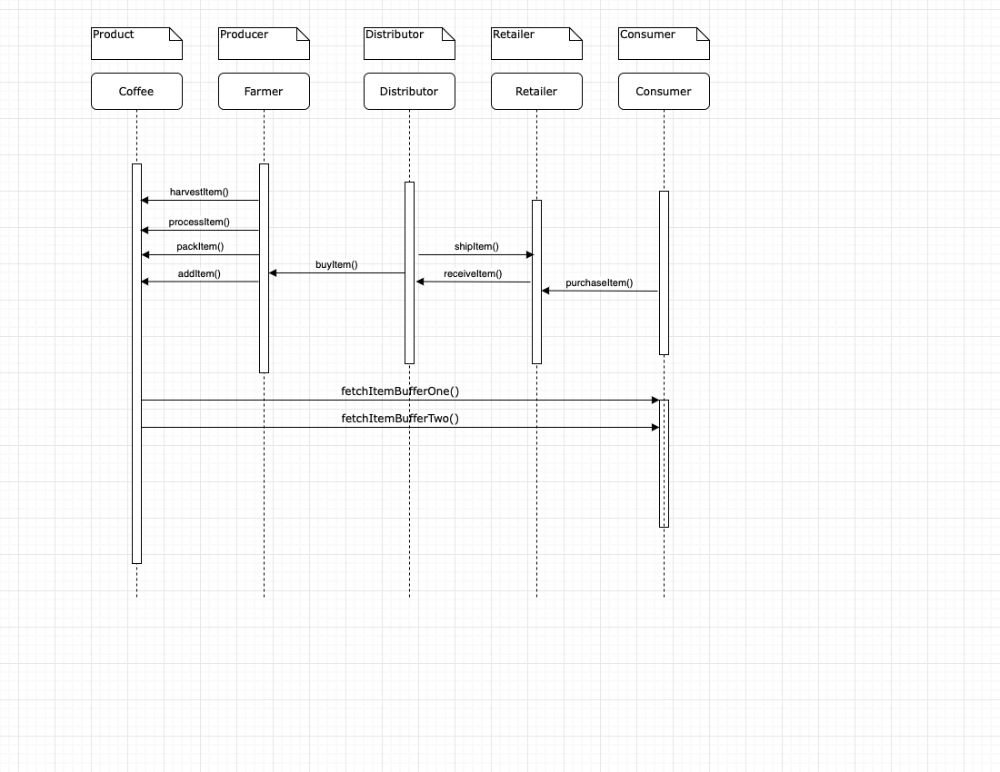

# PROJECT - Ethereum Dapp for Tracking Items through Supply Chain

## Truffle Version
>
    Truffle v5.0.21
>

## Node Version
>
    node v14.16.1
>

## web3 Version
>
    web3@1.3.6
>
## Contract Address
>
     
>

## Requirement 1: Project write-up - UML

### Activity Diagram

### Sequence Diagram

### State Diagram

### Class Diagram (Data Model)

## Requirement 2: Project write-up - Libraries
I used one library called Roles which made it easier to manage AccessControl in my DAPP. It made it easy to add and remove roles in each of my AccessControl contracts (FarmerRole.sol, DistributorRole.sol, RetailerRole.sol, and ConsumerRole.sol).

## Requirement 3: Project write-up - IPFS
I did not use IPFS to deliver my website for this project. However, I could have added my HTML, CSS, and JS files to IPFS in order to fully decentralize my Supply Chain DAPP.